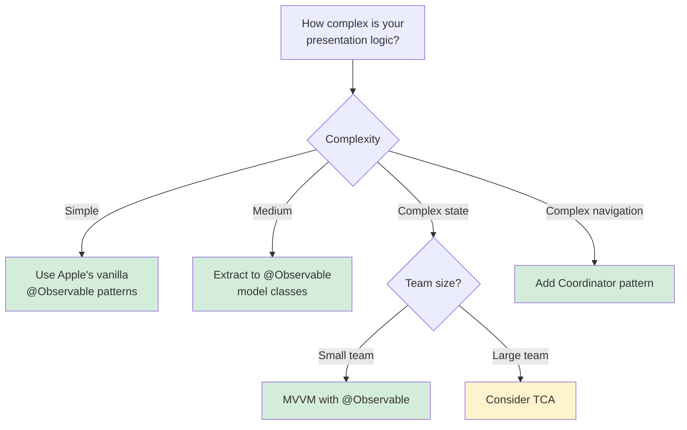
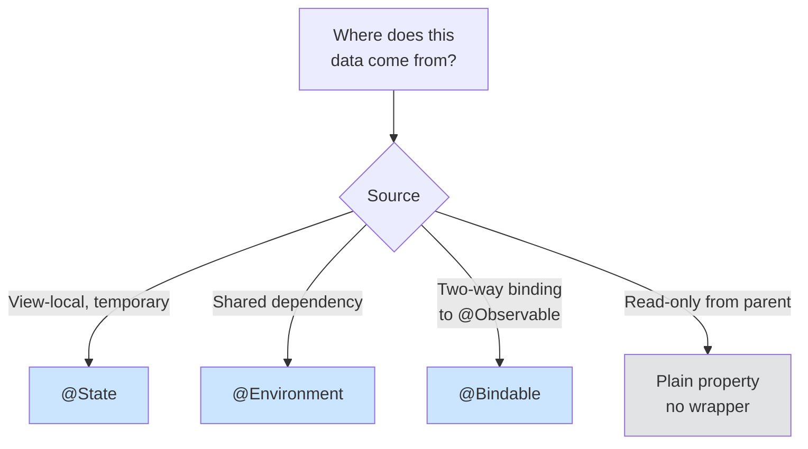

# SwiftUI Architecture

Architecture patterns for modern SwiftUI. Covers Apple's native patterns (@Observable, State-as-Bridge), MVVM, TCA, and Coordinator approaches with decision frameworks for choosing between them.

## When to Use This Skill

Use this skill when you're:
- Logic in SwiftUI view files that you want to extract
- Choosing between MVVM, TCA, vanilla SwiftUI, or Coordinator
- Refactoring views to separate concerns
- Making SwiftUI code testable
- Asking "where should this code go?"
- Deciding which property wrapper to use (@State, @Environment, @Bindable)
- Organizing a SwiftUI codebase for team development

## Example Prompts

Questions you can ask Claude that will draw from this skill:

- "There's quite a bit of code in my view files about logic things. How do I extract it?"
- "Should I use MVVM, TCA, or Apple's vanilla patterns?"
- "How do I make my SwiftUI code testable?"
- "Where should formatters and calculations go?"
- "Which property wrapper do I use?"

## What's Covered

### Apple's Native Patterns
- @Observable for data models (replaces ObservableObject)
- State-as-Bridge for async boundaries (WWDC 2025)
- Three property wrappers: @State, @Environment, @Bindable
- Synchronous UI updates for animations

### MVVM Pattern
- When MVVM adds value (complex presentation logic)
- ViewModel responsibilities
- Testing strategies

### TCA (The Composable Architecture)
- When TCA is appropriate
- Complexity trade-offs
- Team onboarding considerations

### Coordinator Pattern
- When coordinators help
- Navigation separation from views
- State restoration

### Property Wrapper Decision Tree
- @State for view-local state
- @Environment for dependencies
- @Bindable for two-way binding to @Observable
- Plain properties for read-only data

### Refactoring Workflow
- Identifying logic in views
- Extracting to model layer
- Testing extracted code

## Key Pattern

### State-as-Bridge Pattern (WWDC 2025)

```swift
// UI logic stays synchronous (for animations)
// Async code lives in models (testable without SwiftUI)
// State bridges the two

@Observable
class ColorExtractor {
    var isLoading = false
    var colors: [Color] = []

    func extract(from image: UIImage) async {
        isLoading = true
        let extracted = await heavyComputation(image)
        colors = extracted  // Synchronous mutation triggers UI update
        isLoading = false
    }
}

struct ColorView: View {
    @State private var extractor = ColorExtractor()

    var body: some View {
        VStack {
            if extractor.isLoading {
                ProgressView()
            } else {
                // Display colors with animation
            }
        }
        .task { await extractor.extract(from: selectedImage) }
    }
}
```

### Architecture Decision Tree



### Property Wrapper Decision Tree



## Documentation Scope

This page documents the `axiom-swiftui-architecture` skill—architecture patterns Claude uses when you're organizing SwiftUI code, extracting logic from views, or choosing between patterns.

**For navigation:** See [swiftui-nav](swiftui-nav.md) for NavigationStack and deep linking patterns.

**For app-level composition:** See [app-composition](app-composition.md) for @main, root switching, and scene lifecycle.

## Related

- [swiftui-nav](swiftui-nav.md) — Navigation patterns (NavigationStack, deep linking)
- [app-composition](app-composition.md) — App-level patterns (@main, root switching)
- [swift-concurrency](/skills/concurrency/swift-concurrency) — Async patterns for models

## Resources

**WWDC**: 2025-266, 2024-10150, 2023-10149

**Docs**: /swiftui/model-data, /observation
