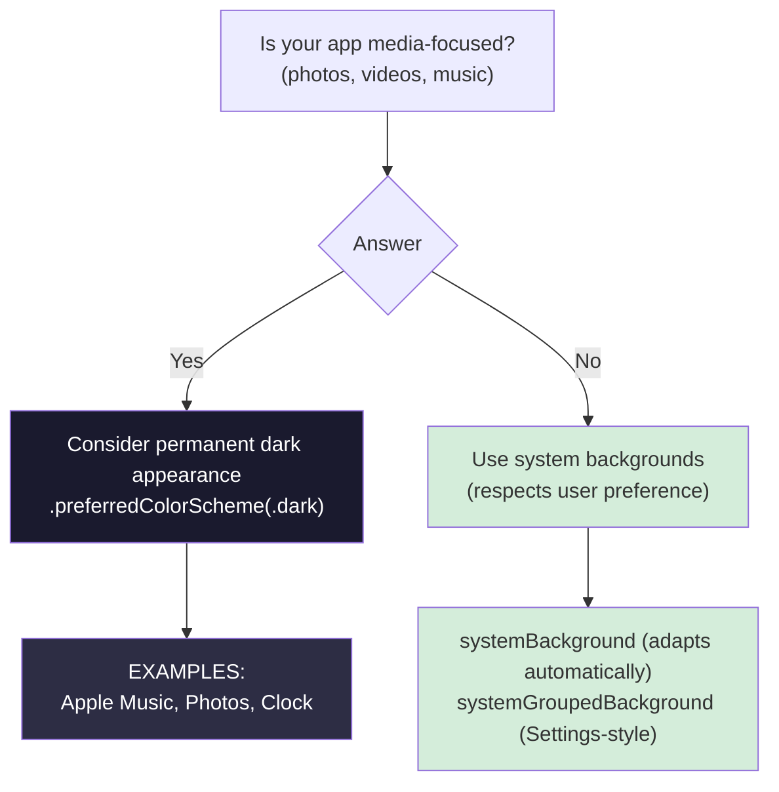
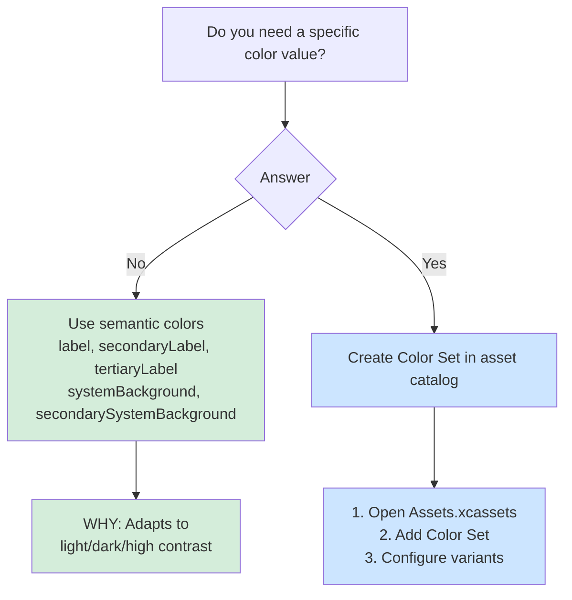

# Human Interface Guidelines

Quick reference for Apple HIG decisions. Covers background colors, typography, colors, icons, and defending design choices.

## When to Use This Skill

Use this skill when you're:
- Making visual design decisions (colors, backgrounds, typography)
- Reviewing UI for HIG compliance
- Answering "Should I use a dark background?"
- Choosing between design options
- Defending design decisions to stakeholders
- Quick lookups for common design questions

**For comprehensive details:** See [hig-ref](/reference/hig-ref) for complete API coverage and code examples.

**For Liquid Glass:** See [liquid-glass](liquid-glass.md) for iOS 26 material design.

## Example Prompts

Questions you can ask Claude that will draw from this skill:

- "Should I use a dark background for my media app?"
- "What semantic colors should I use for labels?"
- "Which font weights are recommended for body text?"
- "How do I create colors that adapt to light/dark mode?"
- "Is my touch target too small?"
- "What's the minimum tappable area for buttons?"

## What's Covered

### Background Colors
- When to use permanent dark appearance (media-focused apps)
- System backgrounds (systemBackground, systemGroupedBackground)
- Respecting user preference vs enforcing appearance

### Colors
- Semantic colors (label, secondaryLabel, etc.)
- System backgrounds hierarchy
- Color Set creation for custom colors
- Light/dark/high contrast variants

### Typography
- Font weight recommendations (avoid Ultralight/Thin/Light)
- Preferred weights: Regular, Medium, Semibold, Bold
- Dynamic Type support

### Touch Targets
- Minimum 44x44pt tappable area
- Spacing between targets

## Key Pattern

### Background Color Decision Tree



### Color Selection Decision Tree



### Font Weight Decision

```swift
// ❌ AVOID — Legibility issues
.font(.system(.body, weight: .ultraLight))
.font(.system(.body, weight: .thin))
.font(.system(.body, weight: .light))

// ✅ PREFER — Good legibility
.font(.system(.body, weight: .regular))
.font(.system(.body, weight: .medium))
.font(.headline)  // Semibold by default
```

## Documentation Scope

This page documents the `axiom-hig` skill—quick HIG decision frameworks Claude uses when you're making design decisions or reviewing UI for compliance.

**For comprehensive reference:** See [hig-ref](/reference/hig-ref) for complete API coverage, code examples, and detailed guidelines.

## Related

- [hig-ref](/reference/hig-ref) — Comprehensive HIG API reference
- [liquid-glass](liquid-glass.md) — iOS 26 Liquid Glass material design
- [swiftui-layout](swiftui-layout.md) — Adaptive layout patterns

## Resources

**WWDC**: 2023-10148 (Design for spatial computing), 2024-10154 (Design tips)

**Docs**: developer.apple.com/design/human-interface-guidelines
