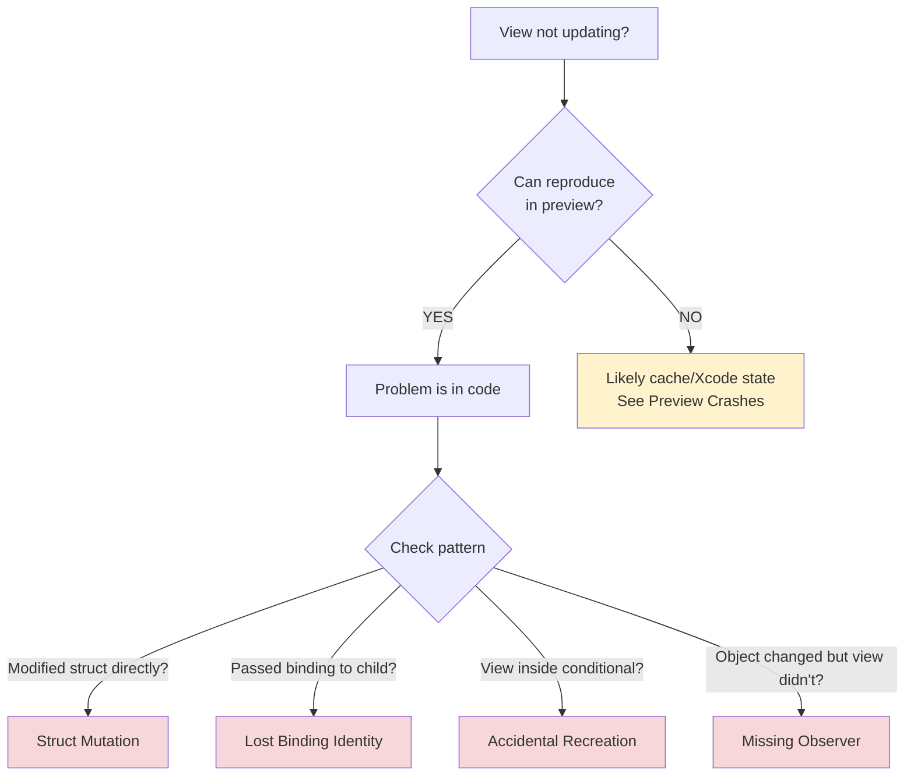

# SwiftUI Debugging

Diagnostic decision trees for SwiftUI issues. Covers view update failures, preview crashes, layout problems, and view identity—with systematic diagnosis to avoid guessing under pressure.

## When to Use This Skill

Use this skill when you're:
- A view isn't updating when you expect it to
- Preview crashes or won't load
- Layout looks wrong on specific devices or screen sizes
- State resets unexpectedly when navigating or toggling conditions
- Tempted to add `@ObservedObject` everywhere as a band-aid

**Core principle:** Start with observable symptoms, test systematically, eliminate causes one by one. Don't guess.

## Example Prompts

Questions you can ask Claude that will draw from this skill:

- "My list item doesn't update when I tap the favorite button, even though the data changed."
- "Preview crashes with 'Cannot find AppModel in scope' but it compiles fine."
- "My counter resets to 0 every time I toggle a boolean, why?"
- "I'm using @Observable but the view still doesn't update when I change the property."
- "Text field loses focus when I start typing, very frustrating."
- "Layout looks wrong on iPad but fine on iPhone."

## What's Covered

### View Not Updating Decision Tree
- **Struct Mutation** — Direct mutation doesn't trigger updates; reassign the full value
- **Lost Binding Identity** — Passing `.constant()` or recreating bindings breaks two-way connection
- **Accidental View Recreation** — Conditionals destroy and recreate views, resetting @State
- **Missing Observer Pattern** — @Observable vs ObservableObject usage

### Preview Crashes Decision Tree
- **Missing Dependencies** — Views need @EnvironmentObject or environment values
- **State Initialization Failures** — Array bounds, optional unwraps, invalid defaults
- **Cache Corruption** — When code builds but preview fails

### Layout Issues Quick Reference
- ZStack ordering and zIndex
- GeometryReader sizing constraints
- SafeArea handling
- Modifier order (bottom-to-top)
- frame() vs fixedSize() behavior

### View Identity
- Structural vs explicit identity
- When `.id()` helps vs hurts
- State preservation with `.opacity()` instead of conditionals

### Debugging Tools
- `Self._printChanges()` for understanding update triggers
- Debug View Hierarchy for layout inspection

## Key Pattern

### Diagnosing View Not Updating



```swift
// Use Self._printChanges() to understand why body was called
var body: some View {
    let _ = Self._printChanges() // Debug only - remove before shipping
    Text("Hello")
}

// Output: "MyView: count changed" tells you which property triggered update
```

## Documentation Scope

This page documents the `axiom-swiftui-debugging` skill—diagnostic decision trees Claude uses when you encounter SwiftUI view update failures, preview crashes, or layout issues.

**For performance profiling:** Use [swiftui-performance](swiftui-performance.md) when the view updates but performance is slow.

**For Xcode environment issues:** Use [xcode-debugging](/skills/debugging/xcode-debugging) when problems are cache corruption or build failures, not SwiftUI code issues.

## Related

- [swiftui-performance](swiftui-performance.md) — Performance profiling with SwiftUI Instrument
- [swiftui-debugging-diag](/diagnostic/swiftui-debugging-diag) — Systematic diagnostic workflows for complex cases
- [xcode-debugging](/skills/debugging/xcode-debugging) — Environment-first diagnostics for cache and build issues
- [swift-concurrency](/skills/concurrency/swift-concurrency) — @MainActor and async/await patterns for data updates

## Resources

**WWDC**: 2021-10022 (Demystify SwiftUI), 2023-10149 (@Observable), 2023-10160 (Performance), 2025-306 (Instruments)

**Docs**: /swiftui/state-and-data-flow, /swiftui/managing-model-data-in-your-app, /observation
