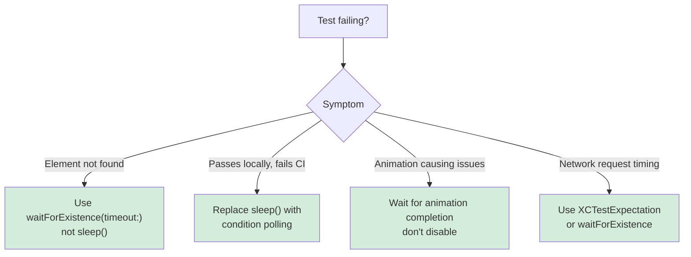

# UI Testing

Reliable UI testing with condition-based waiting patterns. Covers Recording UI Automation (Xcode 26), accessibility-first testing, multi-device configurations, and network conditioning.

## When to Use This Skill

Use this skill when you're:
- Writing UI tests for the first time
- Tests pass locally but fail in CI
- Tests use `sleep()` and are flaky
- Recording interactions with Xcode 26's Recording UI Automation
- Tests fail on iPad but pass on iPhone
- Want to test across multiple network conditions

**Core principle:** Wait for conditions, not arbitrary timeouts. Flaky tests come from guessing how long operations take.

## Example Prompts

Questions you can ask Claude that will draw from this skill:

- "My UI tests pass locally on my Mac but fail in CI. How do I make them more reliable?"
- "My tests use sleep(2) and sleep(5) but they're still flaky."
- "I recorded a test using Xcode 26's Recording UI Automation. How do I debug failures?"
- "My test fails on iPad but passes on iPhone."
- "How do I write tests that aren't flaky?"
- "How do I test my app under slow network conditions?"

## What's Covered

### Condition-Based Waiting
- `waitForExistence(timeout:)` instead of `sleep()`
- `XCTNSPredicateExpectation` for element disappearance
- Predicate-based waiting for specific states
- Appropriate timeouts (2s UI, 10s network, 30s max)

### Recording UI Automation (Xcode 26)
- Three phases: Record → Replay → Review
- Accessibility identifiers as foundation
- Query selection (stable identifiers over labels)
- Video debugging with UI element overlays

### Accessibility-First Testing
- `.accessibilityIdentifier()` for stable element queries
- Avoiding hardcoded localized labels
- Accessibility Inspector for reviewing elements
- `performAccessibilityAudit()` in tests

### Test Plans
- Multiple device/language configurations
- Video and screenshot capture settings
- Right-to-left language testing
- Xcode Cloud integration

### Network Conditioning
- Network Link Conditioner for slow network simulation
- 3G profile for edge case failures
- Longer timeouts for slow networks
- Catch device + network combination failures

### Debugging Test Failures
- Video review workflow
- UI element overlay at failure point
- Crash log analysis
- Concurrency bugs revealed by tests

## Key Pattern

### Condition-Based Waiting

```swift
// ❌ WRONG — Arbitrary timeout
func testButtonAppears() {
    app.buttons["Login"].tap()
    sleep(2)  // Guessing it takes 2 seconds
    XCTAssertTrue(app.buttons["Dashboard"].exists)
}

// ✅ CORRECT — Wait for condition
func testButtonAppears() {
    app.buttons["Login"].tap()
    let dashboard = app.buttons["Dashboard"]
    XCTAssertTrue(dashboard.waitForExistence(timeout: 5))
}
```

### Accessibility Identifiers

```swift
// In app code
Button("Submit") { }
    .accessibilityIdentifier("submitButton")

// In test code — stable across localizations
let submitButton = app.buttons["submitButton"]
XCTAssertTrue(submitButton.waitForExistence(timeout: 5))
```

### Decision Tree



## Documentation Scope

This page documents the `axiom-ui-testing` skill—reliable UI testing patterns Claude uses when you're writing or debugging XCTest UI tests. Covers condition-based waiting, Recording UI Automation (Xcode 26), accessibility-first testing, and multi-configuration testing.

**For TDD workflow:** See the superpowers:test-driven-development skill for test-driven development methodology.

**For Swift Testing framework:** See [swift-testing](/skills/testing/swift-testing) for the new Swift Testing framework patterns.

## Related

- [swift-testing](/skills/testing/swift-testing) — Swift Testing framework patterns
- [swift-concurrency](/skills/concurrency/swift-concurrency) — @MainActor patterns for crash debugging
- [xcode-debugging](/skills/debugging/xcode-debugging) — Environment diagnostics when tests fail due to Xcode issues

## Resources

**WWDC**: 2025-344 (Recording UI Automation), 2023-10175 (Test Reports), 2023-10035 (Accessibility Audits)

**Docs**: /xctest, /xcuiautomation/recording-ui-automation-for-testing, /accessibility/performing_accessibility_testing_for_your_app
